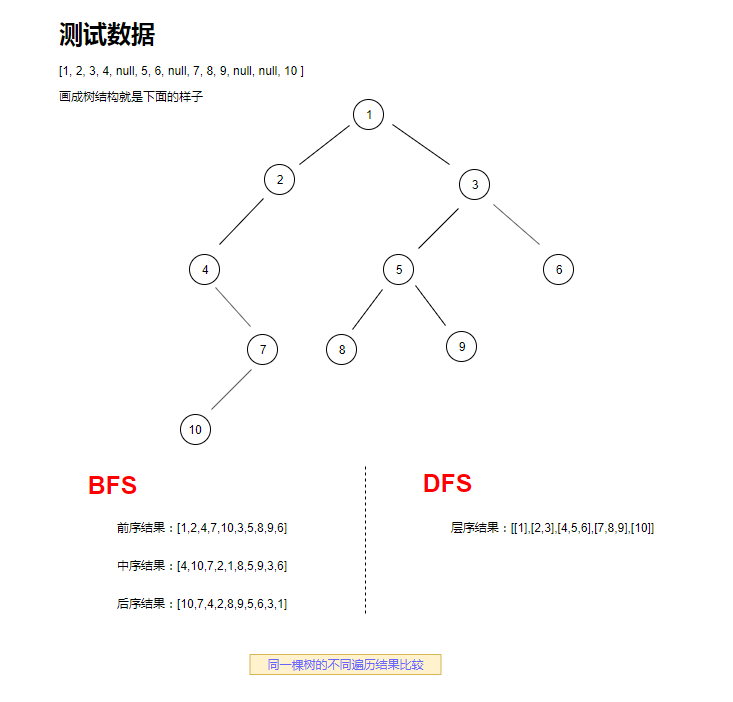

### 二叉树基本信息与遍历算法
#### 什么是二叉树
  二叉树是每个节点最多只有两个分支（即不存在分支度大于2的节点）的树结构。

#### 二叉树的遍历
遍历的分类
  - DFS(深度优先搜索，Deep First Search)--常用栈(`先进后出`)操作
    - 前序遍历
    - 中序遍历
    - 后序遍历
  - BFS(广度优先搜索，Breadth First Search)--使用队列
    - 层次遍历

#### 各种遍历思路--名称以`根`位置为参照
1. 前序遍历(根-左-右)
    - 根节点入栈
    - 出栈一个元素，将右节点和左节点依次入栈
    - 重复b步骤

      - [例题](../problem_medium/144.binary-tree-preorder-traversal.md)

2. 中序遍历(左-根-右)
    - 根节点入栈
    - 判断有无左节点，有则入栈，直到叶子节点
    - 出栈，判断有没有右节点，有则入栈，继续执行b
    
      - [例题](../problem_medium/94.binary-tree-inorder-traversal.md)

3. 后序遍历(左-右-根)
    - 根节点入栈
    - 判断栈顶节点不是叶子节点且子节点未被读取；成立就将右、左节点依次入栈，否则就读取该节点值而后将该节点出栈
    - 出栈的元素需要暂存，用作下次循环中判断子元素已被读值的节点；
    - 当stack空了，循环结束
      - [例题](../problem_hard/145.binary-tree-postorder-traversal.md)

    难点在于判断`子节点已被读取值的节点`(个人观点)

4. 层次遍历
    - 将根节点入队列，再入null
    - 队首元素P出队列，P非null则取P值并且将P的子节点入队列；
    - 如果当前队列首元素为null,则上一层节点全被遍历，子节点都已入队列需加入结束标志;
    - 当队列为空时，终止循环

      - [例题](../problem_medium/102.binary-tree-level-order-traversal.md)

#### 感想
曾今也是学过算法课的，但是对于书本内容理解太死板(并没有实例化到代码里);
导致自己根本不理解，也完全消化不了
就目前来说，算法体现在代码上是很重要的(以及应用场景，方便记忆)

见过一道实际题后，会觉得选择哪种遍历方式是肯定的(需求决定方式)
在这些抽象概念里面咬文嚼字十天不如见一个真**需求**十分钟
