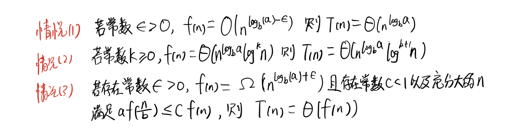

## 主定理(算法导论)
[视频资源，主定理与快速记忆](https://v.youku.com/v_show/id_XMzY1NDYxMTA5Ng==.html?)  
观看密码： eogo3027fg

什么是主定理，它有什么作用，适用于哪些情况？ 
主定理适用于`分治法` 

### 三种情况
  

### 我能提出什么问题？
这个东西有什么作用啊？  

### 推理过程，暂时忽略

### 学会主定理，时间复杂度就可以很容易计算出来？
