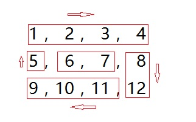

### 题目
```
Given a matrix of m x n elements (m rows, n columns), return all elements of the matrix in spiral order.

Example 1:

  Input:
    [
      [ 1, 2, 3 ],
      [ 4, 5, 6 ],
      [ 7, 8, 9 ]
    ]
  Output: [1,2,3,6,9,8,7,4,5]
Example 2:

  Input:
    [
      [1, 2, 3, 4],
      [5, 6, 7, 8],
      [9,10,11,12]
    ]
  Output: [1,2,3,4,8,12,11,10,9,5,6,7]
```
[Leetcode原题](https://leetcode.com/problems/spiral-matrix/)

### 思路
1. 剥洋葱，row->col->row->col 为一次；
2. row->col、col->row 的切换都伴随读取的初始位置的变化；
3. 结束条件是row头>row尾或者col顶>col底



### 代码
```js
/**
 * @param {number[][]} matrix
 * @return {number[]}
 */
var spiralOrder = function(matrix) {
    if(matrix.length === 0) return [];
    let rowT = 0; // 行顶
    let rowB = matrix.length - 1; // 行底
    let colL = 0; // 列左
    let colR = matrix[0].length - 1; // 列右
    let result =  [];
    // 顺序是行、列、行、列；每次切换，读取的初始位置都会变化1(+/- 1)
    while (colL <= colR && rowT <= rowB) {
      for (let a = colL; a <= colR; a++) {
        result.push(matrix[rowT][a]);
      }
      rowT++;
      for (let b = rowT; b <= rowB; b++) {
        result.push(matrix[b][colR]);
      }
      colR--;
      for (let c = colR; c >= colL && rowB >= rowT; c--) {
        result.push(matrix[rowB][c]);
      }
      rowB--;
      for (let d = rowB; d >= rowT && colR >= colL; d--) {
        result.push(matrix[d][colL]);
      }
      colL++;
    }
    return result;
};
```

### 知识基础补充
for循环第一次运行，先判断条件是否成立才执行循环体内代码
> 顺序是for(1; 2; 4) { 3 }
```js
for(let i = 3; i < 2; i++) {
	console.log('sdfhj', i);
}
// 无输出
for(let i = 1; i < 2; i++) {
	console.log('sdfhj', i);
}
// sdfhj 1
```

### 感想
1. 按照网友的思路，我去想了；感觉可以走，但是有关键的点不知道如何用代码体现出来(相邻)
2. 遇到难题时自己想办法，感觉就是去配答案；这样比较低效，不知道有没有更好的办法
