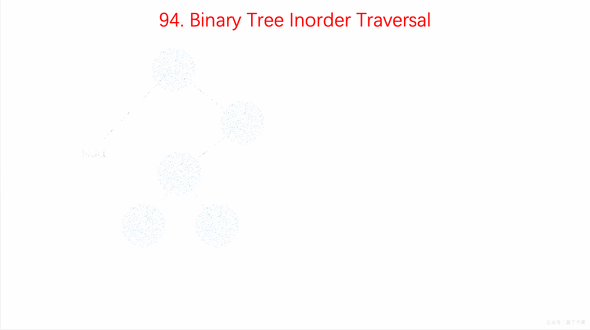

### 题目
```
Given a binary tree, return the inorder traversal of its nodes' values.

Example:

Input: [1,null,2,3]
   1
    \
     2
    /
   3

Output: [1,3,2]
Follow up: Recursive solution is trivial, could you do it iteratively?
```
[leetcode原题](https://leetcode.com/problems/binary-tree-inorder-traversal/)

### 思路
中序遍历是`左-根-右`
1. 递归方式
    - 判断根节点，不存在则返回空数组
    - 判断左节点是否存在
    - 存在，读取值。再读取根节点，再是右节点。
2. 利用栈
    - 先将根节点入栈
    - 再将左侧节点全部入栈
    - 出栈一个节点并保存其值；将其右节点下的左侧节点入栈；
    - 重复上述步骤


### 代码
```
/**
 * Definition for a binary tree node.
 * function TreeNode(val) {
 *     this.val = val;
 *     this.left = this.right = null;
 * }
 */
/**
 * @param {TreeNode} root
 * @return {number[]}
 * 递归，很简单
 */
var inorderTraversal = function(root, arr = []) {
    if(!root) return []
    if(root.left) {
      inorderTraversal(root.left, arr);
    }
    arr.push(root.val);
    if(root.right) {
      inorderTraversal(root.right, arr);
    }
    return arr
};
/**
 * @param {TreeNode} root
 * @return {number[]}
 * 利用栈，主要考的是这个
 */
var inorderTraversal = function(root, arr = []) {
    if(!root) return []
    const stack = [root];
    let temp = null;
    let left = root.left
    while(left) {
      stack.push(left);
      left = left.left;
    }

    while(temp = stack.pop()) {
      arr.push(temp.val)
      let t = temp.right

      while(t) {
        stack.push(t)
        t = t.left // 将节点下的左节点全部入栈
      }
    }
    
    return arr
};
```

### 感想
使用栈结构来遍历时，会套用前序遍历那种模式来做中序遍历。即使前序那种模式不适用我也走不出来，
想出方案了也不够自信去做，非得看下别人怎么写才敢按自己想法来(可能是觉着试错的代价太高了吧)。
总结为--其实还是不会

初步代码一般是粗写的，有的代码可以简写也是后期优化而来。

思路的文字表述不够有条理，目前只能是自己能看懂吧
